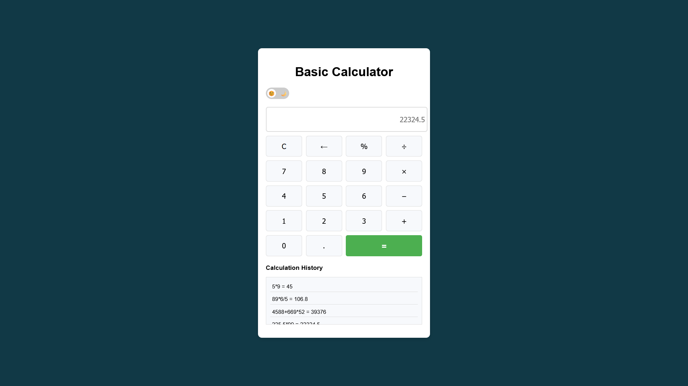

# 🌟 Basic Calculator

A modern, responsive, and feature-rich calculator built with **HTML**, **CSS**, and **JavaScript**. This project supports basic arithmetic operations, advanced scientific functions, and a toggleable **dark mode** for an enhanced user experience.


## 🚀 Features
- **Basic Arithmetic Operations**:
  - Addition (+), Subtraction (-), Multiplication (*), Division (/), Modulus (%).
- **Scientific Functions**:
  - Square roots (√), Exponentiation (x²), Logarithms (log), and Trigonometric functions (sin, cos, tan).
- **Dark Mode**:
  - Toggle between light and dark themes with a smooth transition.
  - Persistent theme settings saved in local storage.
- **Calculation History**:
  - Displays previous calculations with improved styling and spacing.
- **Responsive Design**:
  - Fully optimized for desktop and mobile devices.


## 📸 Demo



## 📂 Directory Structure
```plaintext
basic-calculator/
├── assets/
│   └── screenshot.png
├── LICENSE
├── index.html
├── styles.css
├── script.js
└── README.md
```

## 📖 How to Use
Clone and Run Locally:

1. Clone the repository:

    ```bash
    git clone https://github.com/marwan-ahmed-23/basic-calculator.git
    ```

2. Navigate to the project directory:

    ```bash
    cd basic-calculator
    ```

3. Open `index.html` in your browser.

> ### View Online:
> You can also host the project on any static hosting platform (e.g., GitHub Pages, Netlify, Vercel).


## 🛠️ Customization
How to Customize:
- Modify `styles.css` for custom themes or layouts.
- Add or edit functions in `script.js` for advanced operations.
- Update `index.html` to personalize the UI.

## 🤝 Contributions
Contributions are welcome! If you'd like to improve or extend the functionality, feel free to fork the repository and submit a pull request.

## 🌟 Stay Connected
- Star this repository if you find it helpful! ⭐
- Share your feedback or suggestions to help us improve.